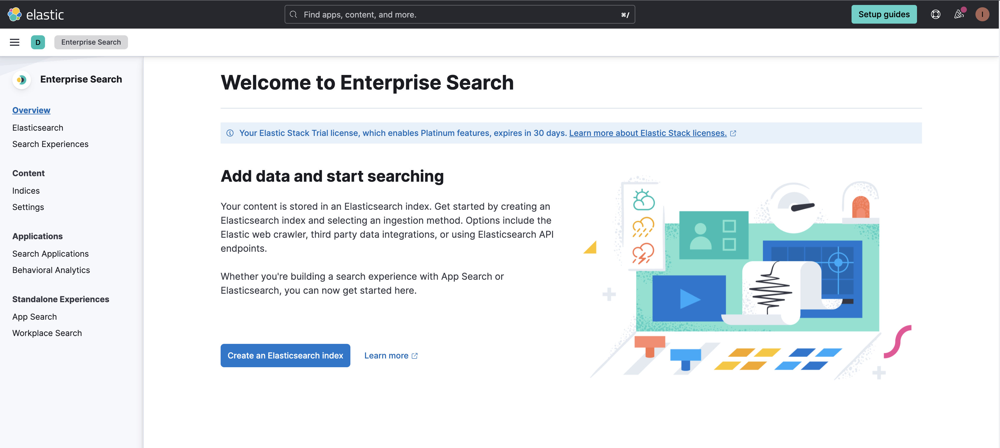
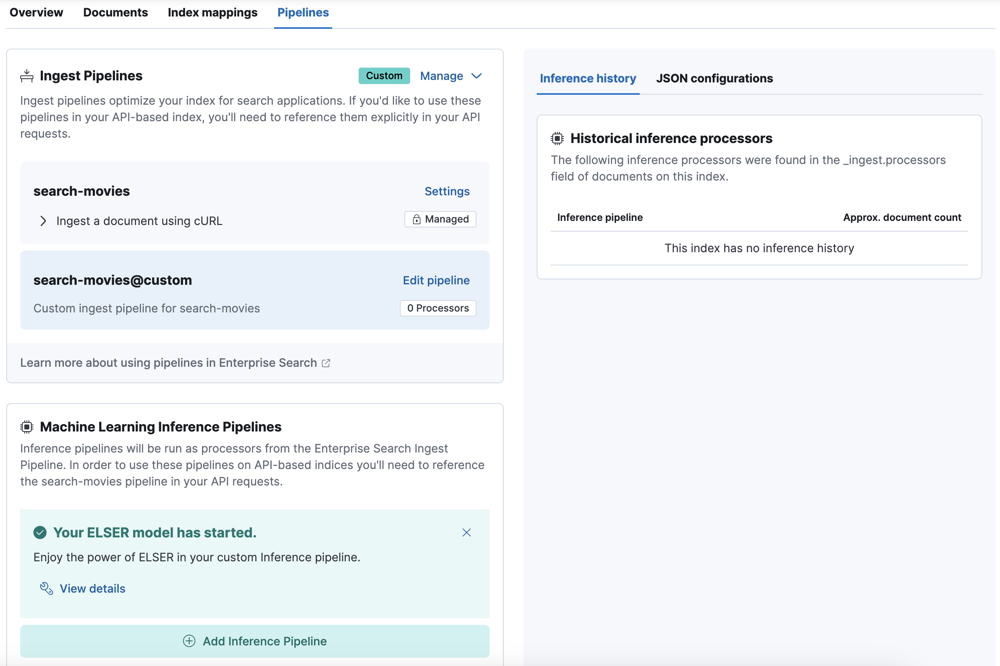
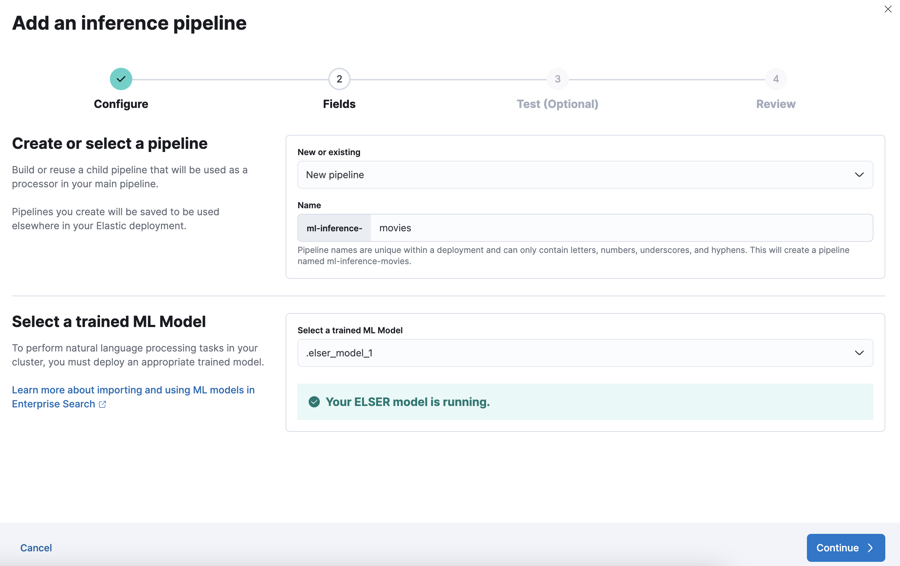
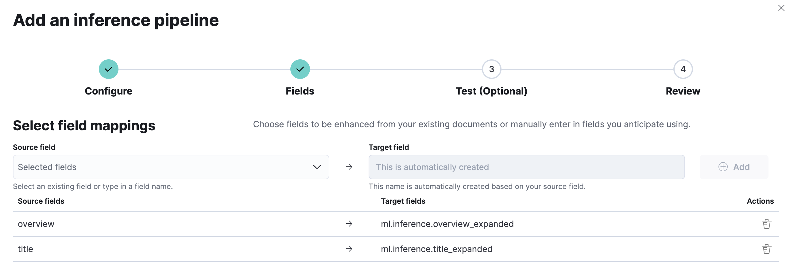

# Relevance workbench

This application allows you to compare results ranking between the ELSER model and BM25. 

You can also try with your own data by forking this repo and plugging the application to your own Elasticsearch deployment. 

# Deploy with default dataset

## Pre-requisites

To run this demo successfully, you will need an Elasticsearch deployment (> 8.8) with the ELSER model deployed. The easiest way for this is to use Elastic Cloud as described in the next part but you can also deploy Elasticsearch locally.  

## Deploy Elasticsearch in Elastic Cloud

Start by signing up for a [free Elastic Cloud trial](https://cloud.elastic.co/registration). After creating an account, you’ll have an active subscription, and you’ll be prompted to create your first deployment.

Follow the steps to Create a new deployment. For more details, refer to [Create a deployment](https://www.elastic.co/guide/en/cloud/current/ec-create-deployment.html) in the Elastic Cloud documentation.

Save the default admin password in a safe place. 

## Deploy Elastic Learned Sparse Encoder model

You can follow this [documentation](https://www.elastic.co/guide/en/machine-learning/master/ml-nlp-elser.html#download-deploy-elser) to deploy and start the model on your deployment.

## Load the data

The best approach is to use Enterprise Search to create a new index and configure the ingest pipeline to enrich the data.

From the landing page in Kibana, navigate to Enterprise Search. 



Here, click on Create an Elasticsearch index and choose the API method. 

Name the index `search-movies`, and click on Create index. 

Navigate to Pipelines and click on Copy and customize.



Now click on Add Inference pipeline to configure the inference pipeline. 

Name the inference pipeline `ml-inference-movies` and select the ELSER model. Click continue.



On the next screen, add the fields `overview` and `title` and click Continue. 



Click Continue to review the changes and then Create pipeline. 

Go to the folder `data` and run the python script `index-data.py` to ingest the movies dataset. 

```
python3 index-data.py --es_password=<ELASTICSEARCH_PASSWORD> --cloud_id=<CLOUD_ID>
```

- ELASTICSEARCH_PASSWORD: Use the default admin password previously saved
- CLOUD_ID: You can find this information in your Elastic Cloud admin console

## Run the application

The application is composed of a backend Python API and a React frontend. You can run the whole application locally using Docker compose. 

Edit the `docker-compose.yml` file to replace values for. Reuse the same information that you use for loading the data. 
- CLOUD_ID=<CLOUD_ID>
- ELASTICSEARCH_PASSWORD=<ELASTICSEARCH_PASSWORD>

Run `docker-compose up` to start the application. 

Open [localhost:3000](http://localhost:3000) to access the application.


